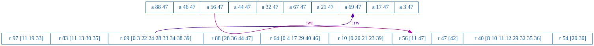
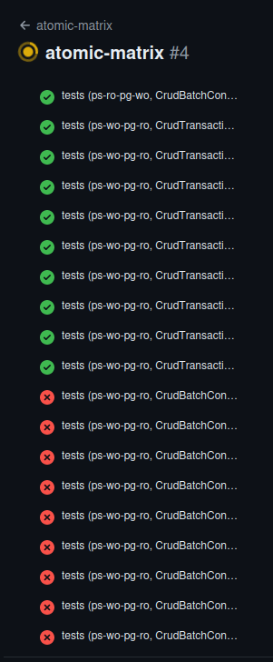
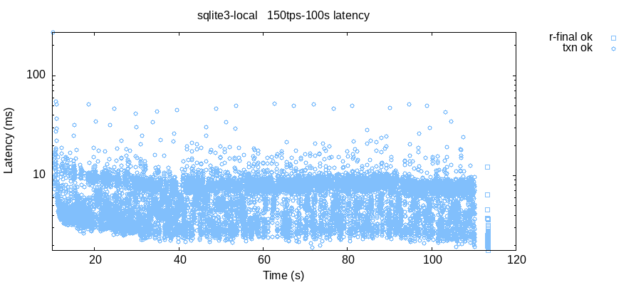

## Logbook

### In Process

Add partitioning and process kill nemeses to flush out more errors and observe behaviors.

---

### Known Errors In New CrudTransactionConnector 

- PostgreSQL could not serialize access due to concurrent update
  - Max retries, 10, exceeded

TODO: Implement exponential backoff?

----

### Errors That Aren't Understood Yet

As the range of testing has increased, a couple of potential issues that stop PostgreSQL -> client db replication have surfaced:

```clj
; can crash client
; from client logs:
:logs-ps-client {:valid? false,
                  :count 160,
                  :matches ({:node "n2",
                             :line "ERROR - 2024-07-02 18:42:24.432226"}
                            ...)}
```

```clj
; can break replication and convergence
; example of all clients doing a different final read of key 0
:divergent-reads {0 {nil #{"n3"},
                     [2 5] #{"n4"},
                     [3 4 7] #{"n1"},
                     [6] #{"n2"},
                     [1] #{"n5"}}}
                 ...
```

Let's:
- shrink the tests to the smallest reproducible
- trace a few transactions end-to-end
- insure that it's not a test artifact, incorrect usage
- maybe explore a Dart CLI app that reproduces?

Test command:
```bash
lein run test --workload convergence --rate 100 --time-limit 30 --nodes n1,n2,n3,n4,n5 --postgres-nodes n1
```

Smallest example of divergence:
```clj
:divergent-reads {0 {nil #{"n3"
                           "n4"
                           "n5"},
                     [3] #{"n1" "n2"}}}
```

Turn on PostgreSQL statement logging to see replication from `CrudTransactionConnector`:

- see correct transaction isolation
  ```log
  LOG:  execute <unnamed>: SET SESSION CHARACTERISTICS AS TRANSACTION ISOLATION LEVEL READ COMMITTED
  LOG:  execute <unnamed>: SHOW TRANSACTION ISOLATION LEVEL
  LOG:  execute <unnamed>: SET SESSION CHARACTERISTICS AS TRANSACTION ISOLATION LEVEL REPEATABLE READ
  ```
- see correct handling of concurrent conflict retries
  ```log
  LOG:  statement: COMMIT;
  ERROR:  could not serialize access due to concurrent update
  STATEMENT:  UPDATE lww SET v = $1 WHERE id = $2 RETURNING *
  LOG:  statement: ROLLBACK;
  ```

----

## History

### Exercise Backend Connector By Partitioning

```clj
(c/su
   (c/exec :iptables
           :-A :INPUT
           :-s :powersync
           :-j :DROP
           :-w)
   (c/exec :iptables
           :-A :INPUT
           :-s :pg-db
           :-j :DROP
           :-w))
```

Jepsen log:
```log
:nemesis	:info	:partition-sync	:majority
...
:nemesis	:info	:partition-sync	{"n1" :partitioned, "n3" :partitioned, "n4" :partitioned}
...
:nemesis	:info	:heal-sync	nil
...
:nemesis	:info	:heal-sync	{"n1" :healed, "n2" :healed, "n3" :healed, "n4" :healed, "n5" :healed}
```

Observations:
- client always reconnects when partition heals
- more likely to end up in a divergent state

----

### Exercise Backend Connector By Disconnecting/Connecting

```dart
await db.connect(connector: connector);
await db.disconnect();
```

Jepsen log:
```log
2024-07-18 20:03:19,792 :nemesis	:info	:disconnect	:majority
2024-07-18 20:03:19,796 :nemesis	:info	:disconnect	{"n1" :disconnected, "n3" :disconnected, "n5" :disconnected}
...
2024-07-18 20:03:24,403 :nemesis	:info	:connect	nil
2024-07-18 20:03:24,412 :nemesis	:info	:connect	{"n1" :connected, "n2" :connected, "n3" :connected, "n4" :connected, "n5" :connected}
```

PowerSync Endpoint log:
```log
[powersync_endpoint] FINEST: statusStream: SyncStatus<connected: true connecting: false ...>
GET     [200] /powersync/connect
[powersync_endpoint] FINEST: statusStream: SyncStatus<connected: false connecting: false ...>
[powersync_endpoint] FINEST: statusStream: SyncStatus<connected: true connecting: false ...>
```

Observations:
- disconnecting/connecting is reliable
  - client seems more resilient, likely to strongly converge, than normal operations
  - only error that's reproducible is PostgreSQL could not serialize access due to concurrent update, max retries exceeded
- doing a connect on an already connected connection seems to trigger a disconnect then a connect

TODO / Questions:
- are `connect/disconnect` idempotent?
  - check if connect causes an initial disconnect?

----

### Initial Atomic Transaction Orientated Backend Connector

Example of a non-atomic transaction replication from a PowerSync write to a PostgreSQL read:
- PowerSync, top transaction, writes '47' to random keys
- PostgreSQL, bottom transaction, reads some but not all of the PowerSync writes in its transaction

Note that all writes are synced, Strong Convergence, but not on transaction boundaries. 



#### CrudTransactionConnector (PostgreSQL transaction orientated)

New `CrudTransactionConnector`:
- `uploadData` tightly coupled to a PostgreSQL transaction
- eager
  - processes all available transactions
  - wants local db to be available for sync updates
- PostgreSQL transactions are executed with an isolation level of repeatable-read
  - so app retries on concurrent access Exceptions

Can clearly see the effects of different connectors and atomic transactions:



#### Implementation

Specify backend connector at runtime:
- cli: `--backend-connector CLASSNAME`
- .env: `BACKEND_CONNECTOR=CrudTransactionConnector`

Expect no Exceptions, and mean it:
```dart
// log PowerSync status changes
// monitor for upload error messages, there should be none
db.statusStream.listen((syncStatus) {
  if (syncStatus.uploadError != null) {
    log.severe(
        'Upload error detected in statusStream: ${syncStatus.uploadError}');
    exit(127);
  }
```

New workloads that isolate, emphasize PowerSync -> PostgreSQL and PostgreSQL -> PowerSync replication.
Simple way to show atomic/non-atomic replication with different backend connectors:

- `ps-wo-pg-ro` PowerSync write only, PostgreSQL read only 
- `ps-ro-pg-wo` PowerSync read only, PostgreSQL write only

Sample test commands:
```bash
lein run test --workload ps-wo-pg-ro --rate 20 --time-limit 60 --nodes n1,n2 --postgres-nodes n1 --backend-connector CrudBatchConnector
lein run test --workload ps-ro-pg-wo --rate 20 --time-limit 60 --nodes n1,n2 --postgres-nodes n1 --backend-connector CrudTransactionConnector
```

[GitHub action](https://github.com/nurturenature/jepsen-powersync/actions/workflows/atomic-matrix.yml).

----

### PowerSync, w/sync, Single User

`CrudBatchConnector`
- `fetchCredentials`
  - generate permissive JWT
- `uploadData`
  - `CrudBatch` oriented
  - one `CrudBatch` per call, not eager
  - one `CrudEntry` at a time
  - reuses single Postgres `Connection`
  - consistency quite casual, not at all causal, will allow:
    - non-Atomic transactions
    - Intermediate Reads
    - Monotonic Read cycling
- `Exception` handling:
  - recoverable
    - `throw` to signal PowerSync to retry
  - unrecoverable
    - indicates architectural/implementation flaws
    - not safe to proceed
    - `exit` to force app restart and resync
  
The `CrudBatchConnector` was design to be the minimum needed to go end-to-end.

Test results:
- PowerSync writing, PostgreSQL reading:
  - total availability
  - non-atomic transactions
  - Strong Convergence

- PowerSync reading, PostgreSQL writing:
  - total availability
  - Repeatable Read
  - Strong Convergence

Notes:
- TODO: check on performance of replication with direct writes to PostgreSQL
  - tests can cause long periods of replication
  - but always strongly converges
  
Test command:
```shell
lein run test --workload ps-ro-pg-wo --rate 10 --time-limit 60 --nodes n1,n2 --postgres-nodes n1
lein run test --workload ps-wo-pg-ro --rate 10 --time-limit 60 --nodes n1,n2 --postgres-nodes n1
```

----

### PowerSync, localOnly: true, Single User

Demonstrates
- PowerSync's `PowerSyncDatabase` driver, `libpowersync.so` native ffi lib
- initial `NoOpConnector` for local only 
  - permissive auth JWT/JWS for development
  - no `uploadDate()` as `localOnly: true`
- Docker
  - full PowerSync service
  - config, env
- longer test runs
  - 10k's of transactions

Test results:
- total availability
- strict serializability

```clj
{:stats {:count 35802,
         :ok-count 35802,
         :fail-count 0,
         :info-count 0},
 :workload {:list-append {:valid? true},
            :logs-ps-client {:valid? true, :count 0, :matches ()}},
 :valid? true}
 ```
Action and workload were a stepping stone and have been retired.

~~GitHub [Action](https://github.com/nurturenature/jepsen-powersync/actions/workflows/powersync-local.yml).~~

~~Test command:~~
```shell
lein run test --workload powersync-local --rate 150 --time-limit 1000 --nodes n1
```

----

### Initial Endpoint Test

Implementation
- Dart CLI app
- PowerSync's `sqlite_async` driver
- native `libsqlite3-dev.so` implementation
- exposes an http post API for Jepsen to submit transactions

Demonstrates
- basic automated building/installing, starting/stopping, of Dart apps
- endpoint
  - correct handling of Jepsen transaction maps
  - roundtrip type handling from Jepsen through endpoint to db and back
  - correct use of driver
- basic end-to-end functionality
- Docker, GitHub Action integration

Test results:
- total availability
- strict serializability

```clj
{:stats {:valid? true,
         :count 11795,
         :ok-count 11795,
         :fail-count 0,
         :info-count 0},
 :workload {:list-append {:valid? true}},
 :valid? true}
```



Action and workload were a stepping stone and have been retired.

~~GitHub [Action](https://github.com/nurturenature/jepsen-powersync/actions/workflows/sqlite3-local.yml).~~

~~Test command:~~
```shell
lein run test --workload sqlite3-local --nodes n1
```
